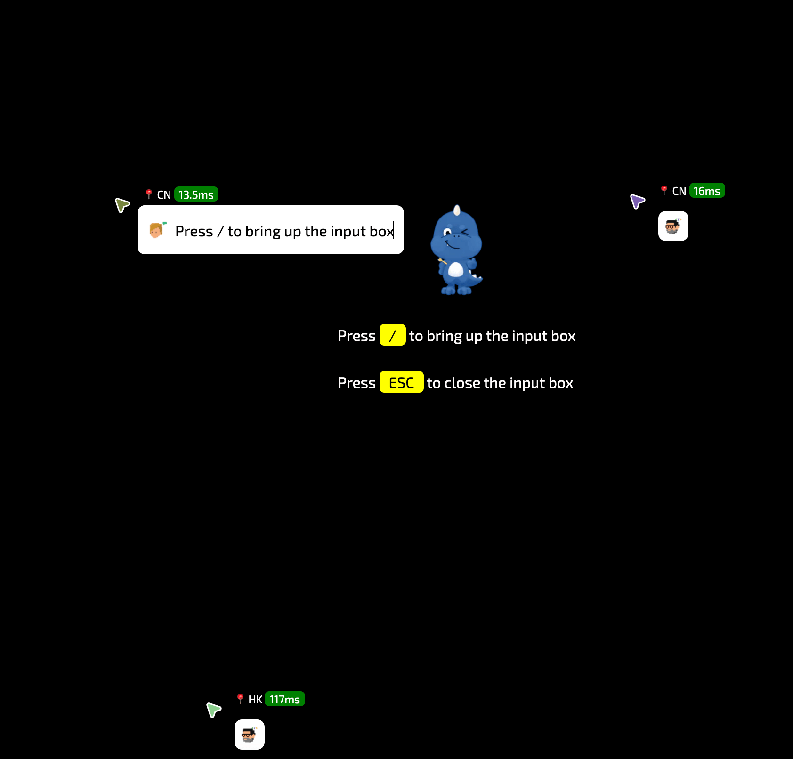

# @yomo/react-cursor-chat

## 🧬 Introduction

A react component helps bring Figma's Cursor Chat to your web applications in less than 3 minutes, making real-time collaboration anywhere.

-   Press `/` to bring up the input box
-   Press `ESC` to close the input box



## 🤹🏻‍♀️ Quick Start

### Installation

by `npm`:

```shell
$ npm i --save @yomo/react-cursor-chat
```

by `yarn`:

```shell
$ yarn add @yomo/react-cursor-chat
```

by `pnpm`:

```shell
$ pnpm i @yomo/react-cursor-chat
```

### Request free dev/test account

Login with your Github account on `https://presence.yomo.run`, will get a free `app_id` and `app_secret`

then, add `.env.local` like:

```bash
APP_ID="abrHlqtooFakeID"
APP_SECRET="nFJqSVzQyhbVgdsBeBojoeJTooFakeSecret"
```

### Integrate to your project

```javascript
import CursorChat from '@yomo/react-cursor-chat';
import '@yomo/react-cursor-chat/dist/cursor-chat.min.css';

const App = () => {
    return (
        <div className="main">
            
            <p className="tips">
                Press <span>/</span> to bring up the input box <br /> Press{' '}
                <span>ESC</span> to close the input box
            </p>
            <CursorChat
                presenceURL="wss://prsc.yomo.dev"
                presenceAuth={{
                    type: 'token',
                    endpoint: '/api/auth',
                }}
                avatar="https://cursor-chat-example.vercel.app/_next/image?url=%2Flogo.png&w=256&q=75"
                theme="light"
            />
        </div>
    );
};

ReactDOM.render(<App />, document.getElementById('root'));
```

### add `/api/auth.js`

```javascript
export default async function handler(req, res) {
    if (req.method === 'GET') {
        try {
            const response = await fetch('https://prsc.yomo.dev/api/v1/auth', {
                method: 'POST',
                headers: {
                    'Content-Type': 'application/json',
                },
                body: JSON.stringify({
                    app_id: process.env.APP_ID,
                    app_secret: process.env.APP_SECRET,
                }),
            });
            const data = await response.json();
            const token = data.data;
            if (token) {
                res.status(200).json(token);
            } else {
                res.status(400).json({ msg: data.message });
            }
        } catch (error) {
            if (typeof error === 'string') {
                res.status(500).json({ msg: error });
            } else if (error instanceof Error) {
                res.status(500).json({ msg: error.message });
            }
        }
    } else {
        // Handle any other HTTP method
    }
}
```

### Start dev

```shell
$ npm run dev
```

## 🥷🏼 for hackers

### Importing the CursorChat component

```jsx
import React from 'react';
import CursorChat from '@yomo/react-cursor-chat';
import '@yomo/react-cursor-chat/dist/cursor-chat.min.css';

// `wss://presence.yomo.dev` is YoMo's free public test service
<CursorChat
    presenceURL="wss://presence.yomo.dev"
    presenceAuth={{
        // Certification Type
        type: 'token',
        // api for getting access token
        endpoint: '/api/auth',
    }}
    avatar="https://avatars.githubusercontent.com/u/67308985?s=200&v=4"
    theme="light"
/>;
```

-   `presenceURL: string`: to set the WebSocket service address.
-   `presenceAuth: { type: 'publickey' | 'token'; publicKey?: string; endpoint?: string; }`: to set `presencejs` service Auth
-   `room?: string`: to set room.
-   `showLatency?: boolean`: to set showLatency.
-   `avatar?: string`: to set avatar.
-   `name?: string`: to set name.
-   `theme?: 'light' | 'dark'`: The background color of the chat box, the default value is "dark".
-   `showLatency?: boolean`: to show connected mesh server and the end-to-end latency.

### Use hooks to customize the component:

```tsx
import React, { useMemo } from 'react';
import { useOnlineCursor, useRenderPosition } from '@yomo/react-cursor-chat';
import CursorIcon from './CursorIcon';

// You can customise the content of your own mouse block
const MeCursor = ({ cursor }) => {
    const refContainer = useRenderPosition(cursor);

    return useMemo(
        () => (
            <div className="cursor" ref={refContainer}>
                <CursorIcon color={cursor.color} />
                {cursor.name && <div>{cursor.name}</div>}
                {cursor.avatar && (
                    
                )}
            </div>
        ),
        []
    );
};

// You can customise what other people's mouse blocks can display
const OthersCursor = ({ cursor }) => {
    const refContainer = useRenderPosition(cursor);
    return (
        <div ref={refContainer} className="cursor">
            <CursorIcon color={cursor.color} />
            {cursor.name && <div>{cursor.name}</div>}
            {cursor.avatar && (
                
            )}
        </div>
    );
};

// Exporting your custom components
const YourComponent = ({ presenceURL, presenceAuth, name, avatar }) => {
    const { me, others } = useOnlineCursor({
        presenceURL,
        presenceAuth,
        name,
        avatar,
    });

    if (!me) {
        return null;
    }

    return (
        <div className="container">
            {others.map(item => (
                <OthersCursor key={item.id} cursor={item} />
            ))}
            <MeCursor cursor={me} />
        </div>
    );
};
```

## Deploy to vercel

`vc --prod`

## Run example

```sh
cd react-cursor-chat/example
npm i
npm run start
```

## LICENSE

<a href="/LICENSE" target="_blank">
    
</a>
