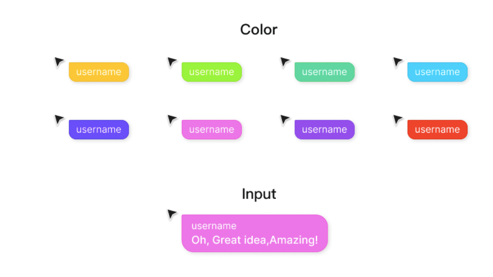
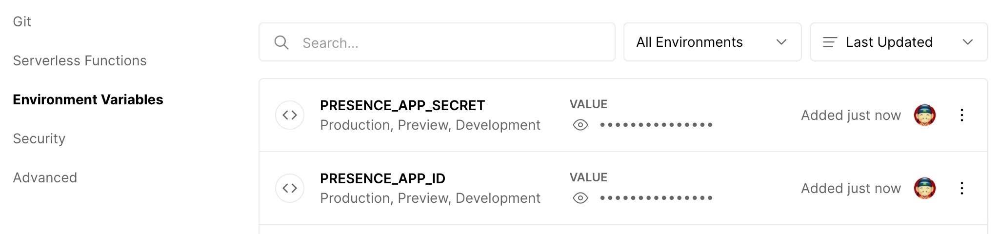

# @yomo/react-cursor-chat


<p align="center">
    </img><br/>
    <a href="https://www.producthunt.com/posts/cursor-chat-anywhere?utm_source=badge-featured&utm_medium=badge&utm_souce=badge-cursor-chat-anywhere" target="_blank"></a>
</p>

## 🧬 Introduction

A react component helps bring Figma's Cursor Chat to your web applications in less than 3 minutes, making real-time collaboration anywhere based on [Presencejs](https://presence.yomo.run).

-   Press `/` to bring up the input box
-   Press `ESC` to close the input box

Online Preview: https://commerce-cursor-chat.vercel.app

Youtube Introduction: https://www.youtube.com/watch?v=28VwErGxn9c

## 🤹🏻‍♀️ Quick Start

### Installation

by `npm`:

```shell
$ npm i --save @yomo/react-cursor-chat
```

by `yarn`:

```shell
$ yarn add @yomo/react-cursor-chat
```

by `pnpm`:

```shell
$ pnpm i @yomo/react-cursor-chat
```

### Request free dev/test account

Login with your Github account on `https://presencejs.yomo.run`, and you will get a free `app_id` and `app_secret`.

Then, create a file named `.env.local` and add the following in it:

```bash
APP_ID="abrHlqtooFakeID"
APP_SECRET="nFJqSVzQyhbVgdsBeBojoeJTooFakeSecret"
```

**Note** - Don't copy the `app_id` and `app_secret` examples mentioned above. Replace it with the one that you will see on your screen. 

### Integrate to your project

```javascript
import CursorChat from '@yomo/react-cursor-chat';
// Import theme styles
// import '@yomo/react-cursor-chat/dist/dracula.css';
// import '@yomo/react-cursor-chat/dist/apricot-yellow.css';
import '@yomo/react-cursor-chat/dist/hairy-green.css';

const App = () => {
    return (
        <div className="main">
            
            <p className="tips">
                Press <span>/</span> to bring up the input box <br /> Press{' '}
                <span>ESC</span> to close the input box
            </p>
            <CursorChat
                presenceURL="https://prsc.yomo.dev"
                presenceAuthEndpoint="/api/auth"
                avatar="https://cursor-chat-example.vercel.app/_next/image?url=%2Flogo.png&w=256&q=75"
            />
        </div>
    );
};

ReactDOM.render(<App />, document.getElementById('root'));
```

### Theme Style

If react-cursor-chat color matches with your website background color, your users might get confused with it.

There are built-in styles in the `@yomo/react-cursor-chat` component: **`apricot-yellow`** and **`hairy-green`**. You should import one of them to use in your web application.

**`hairy-green`**


If you want to change it to apricot yellow, just import `'@yomo/react-cursor-chat/dist/apricot-yellow.css'`.

You can only choose one of them. Then you can see:

**`apricot-yellow`**


Of course you can also override `online-cursor-wrapper__tail-box` , e.g.

```css
/* The css file in your project */
.online-cursor-wrapper__tail-box {
    background-color: #fe6ded; /* Your preferred background color */
}
```

Here you are the react-cursor-chat pallete colors :

<div>
    
</div>

### add `/api/auth.js`

```javascript
export default async function handler(req, res) {
    if (req.method === 'GET') {
        try {
            const response = await fetch('https://prsc.yomo.dev/api/v1/auth', {
                method: 'POST',
                headers: {
                    'Content-Type': 'application/json',
                },
                body: JSON.stringify({
                    app_id: process.env.APP_ID,
                    app_secret: process.env.APP_SECRET,
                }),
            });
            const data = await response.json();
            const token = data.data;
            if (token) {
                res.status(200).json(token);
            } else {
                res.status(400).json({ msg: data.message });
            }
        } catch (error) {
            if (typeof error === 'string') {
                res.status(500).json({ msg: error });
            } else if (error instanceof Error) {
                res.status(500).json({ msg: error.message });
            }
        }
    } else {
        // Handle any other HTTP method
    }
}
```

### Start dev

```shell
$ npm run dev
```

## ▲ Deploy to vercel

Get your free dev server account from https://presencejs.yomo.run, add them to `Enviroment Variables` section to your Vercel Console:



or click this button to try out:

[](https://vercel.com/new/clone?repository-url=https%3A%2F%2Fgithub.com%2Fyomorun%2Fcursor-chat-example&env=PRESENCE_APP_SECRET,PRESENCE_APP_ID&envDescription=Presencejs%20free%20dev%2Ftest%20server%3A%20https%3A%2F%2Fpresence.yomo.run&project-name=try-presencejs&repo-name=try-presencejs&demo-title=Vercel%20Commerce%20with%20%3CCursorChat%20%2F%3E%20component&demo-description=Realtime%20collaboration%20with%20comsumers%20in%20this%20Metaverser%20Commerce&demo-url=https%3A%2F%2Fcommerce-ochre-sigma-86.vercel.app%2F)

## 🥷🏼 for hackers

### Importing the CursorChat component

```jsx
import React from 'react';
import CursorChat from '@yomo/react-cursor-chat';
import '@yomo/react-cursor-chat/dist/hairy-green.css';

// `https://prsc.yomo.dev` is YoMo's free public test service
<CursorChat
    presenceURL="https://prsc.yomo.dev"
    presenceAuthEndpoint="/api/auth"
    avatar="https://avatars.githubusercontent.com/u/67308985?s=200&v=4"
/>;
```

-   `presenceURL: string`: to set the YoMo's service address.
-   `presenceAuthEndpoint: string`: to set api for getting access token
-   `room?: string`: to set room.
-   `showLatency?: boolean`: to show connected mesh server and the end-to-end latency.
-   `avatar?: string`: to set avatar.
-   `name?: string`: to set name.

### Use hooks to customize the component:

```tsx
import React, { useMemo } from 'react';
import { useOnlineCursor, useRenderPosition } from '@yomo/react-cursor-chat';
import CursorIcon from './CursorIcon';
import './your-style.css';

// You can customise the content of your own mouse block
const MeCursor = ({ cursor }) => {
    const refContainer = useRenderPosition(cursor);

    return useMemo(
        () => (
            <div className="cursor" ref={refContainer}>
                <CursorIcon color={cursor.color} />
                {cursor.name && <div>{cursor.name}</div>}
                {cursor.avatar && (
                    
                )}
            </div>
        ),
        []
    );
};

// You can customise what other people's mouse blocks can display
const OthersCursor = ({ cursor }) => {
    const refContainer = useRenderPosition(cursor);
    return (
        <div ref={refContainer} className="cursor">
            <CursorIcon color={cursor.color} />
            {cursor.name && <div>{cursor.name}</div>}
            {cursor.avatar && (
                
            )}
        </div>
    );
};

// Exporting your custom components
const YourComponent = ({
    presenceURL,
    presenceAuthEndpoint,
    room,
    name,
    avatar,
}) => {
    const { me, others } = useOnlineCursor({
        presenceURL,
        presenceAuthEndpoint,
        room,
        name,
        avatar,
    });

    if (!me) {
        return null;
    }

    return (
        <div className="container">
            {others.map(item => (
                <OthersCursor key={item.id} cursor={item} />
            ))}
            <MeCursor cursor={me} />
        </div>
    );
};
```

## LICENSE

<a href="/LICENSE" target="_blank">
    
</a>
